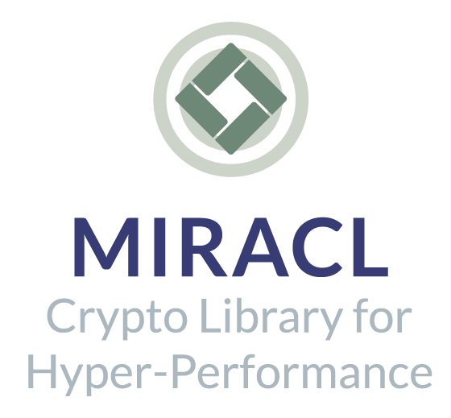
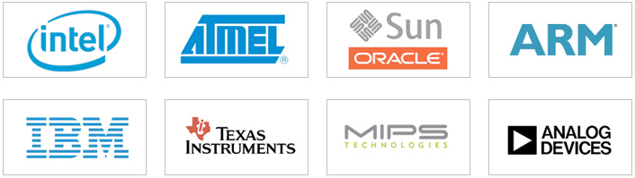

* What Is Miracl
* [Security Advisory](security-advisory.md)
* [Benchmarks](benchmarks.md)
* [Miracl Standard Curves](miracl-standard-curves.md)
* [IEEE 1363](ieee-1363.md)
* [Elliptic Curves](elliptic-curves.md)
* [Licensing](licensing.md)
* Reference Manual
	* [Low Level Routines](reference-manual/low-level-routines.md)
	* [Advanced Arithmetic Routines](reference-manual/advanced-arithmetic-routines.md)
	* [Montgomery Arithmetic Routines](reference-manual/montgomery-arithmetic-routines.md)
	* [ZZn2 Arithmetic Routines](reference-manual/zzn2-arithmetic-routines.md)
	* [Encryption Routines](reference-manual/encryption-routines.md)
	* [Elliptic Curve Routines](reference-manual/elliptic-curve-routines.md)
	* [Floating Slash Routines](reference-manual/floating-slash-routines.md)
	* [Structure Reference](reference-manual/structure-reference.md)

What is Miracl?
---

Multiprecision Integer and Rational Arithmetic C Library – the MIRACL Crypto SDK – is a C software library that is widely regarded by developers as the golden standard open source SDK for elliptic curve cryptography (ECC).

Device or memory constraints? No problem. While there are many libraries that support Cryptography on a PC, MIRACL does more by securing embedded-devices and mobile smart devices like no other SDK in the global market today.  For developers who have found other cryptographic libraries ill suited for these constrained platforms, MIRACL is your answer. MIRACL has support for even the most constrained environments imaginable. In this mode of operation, all memory can be allocated exclusively from the stack so that no fragmenting of precious RAM resources is required. New configuration options further reduce the amount of program code.

MIRACL is particularly adept at methods based on Elliptic Curves, and the new paradigm of Pairing-Based Cryptography.

MIRACL is easy to use, and includes an inline C++ wrapper, which greatly simplifies program development. MIRACL comes with multiple example programs (25+ of them) that cover a wide range of applications, and most are provided in both C and C++ versions.

MIRACL's special purpose macro assembler feature facilitates the achievement of best possible performance from your embedded processor with an automatically generated Assembly Language engine. Use your compiler to compile and run a simple configuration program, which proceeds with user interaction to generate optimal settings for your environment.

AES encryption, RSA public key cryptography, Diffie-Hellman Key exchange and DSA digital signature are all just a few procedure calls away. MIRACL is the gold standard for Elliptic Curve Cryptography over GF(p) and GF(2m) and supports even more esoteric Elliptic Curves and Lucas function based schemes.

Unlike other Cryptographic libraries, MIRACL does not merely provide an opaque interface to a pre-determined set of cryptographic methods, but rather a set of tools that enable any new number-theoretic technique to be implemented quickly so that you, the developer, is free to design your own cryptographic API.

MIRACL comes with a secure channel to connect with the CertiVox Key Management Service out of the box, so your application can get the enhanced security agility of on-board key management right from the get go.  Download MIRACL, learn the code or talk to a solution specialist today to make the most of your MIRACL.

And yes, MIRACL supports mainframes, too!  (Is that really such a big deal?)

## Why is it different?

While many other cryptographic SDKs are focused on PC use, MIRACL also enables developers to build security into highly constrained environments, including embedded, mobile apps and SCADA.

## MIRACL enables:

- reduced program code
- greatly simplified program development
- developer-designed APIs
- rapid implementation, using inline code wrappers, example programs and other innovations.

These unique qualities are the reason MIRACL, and the solutions and services built using it, are in use in hundreds of organisations across the world, including BAE Systems, Hitachi, Intel, Panasonic, Toyota and many others.

## Features and Benefits: why MIRACL is the right choice

MIRACL delivers a wide and unique range of benefits, enabling developers to secure even the most constrained environments quickly, easily and effectively. It features, amongst others:

- an inline C++ wrapper – greatly simplifying program development
- over 25 example programs in C and C++, covering a wide range of applications, to give development a head start
- optimization of both embedded processors and RAM, to help developers overcome device and memory constraints
- compatibility with industry security technologies including AES encryption, RSA public key cryptography, Diffie-Hellman key exchange, DSA digital signature, and others
- a set of tools that enable any new number-theoretic technique to be implemented quickly.

MIRACL also supports a wide range of platforms, including, among others:

