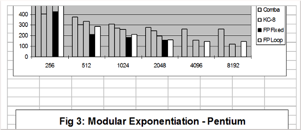

* [Intro](README.md)
* [Installation](installation.md)
* [The UI](the-ui.md)
* [Internal Rep](internal-rep.md)
* Implementation
* [Floating Slash Nums](floating-slash-nums.md)
* [The C++ Interface](the-cpp-interface.md)
* [Example Programs](example-progs.md)
* [The MIRACL Routines](miracl-explained/reference-manual/low-level-routines.md)
* [Instance Variables](instance-variables.md)
* [MIRACL Error Messages](miracl-error-messages.md)
* [Hardware Compiler Interface](hardware-compiler-interface.md)
* [Bibliography](bibliography.md)


Implementation
---

No great originality is claimed for the routines used to implement arithmetic on the big data-type. The algorithms used are faithful renditions of those described by Knuth [Knuth81]. However some effort was made to optimize the implementation for speed. At the heart of the time-consuming multiply and divide routines there is, typically, a need to multiply together a digit from each operand, add in a ‘carry’ from a previous operation, and then separate the total into a digit of the result, and a 'carry' for the next operation. To illustrate consider this base 10 multiplication:
```
    8723536221

        x 9

    78511825989
```
To correctly process the column with the 5 in it, we multiply 5 ´ 9 = 45, add in the ‘carry’ from the previous column (a 3), to give 48, keep the 8 as the result for this column, and carry the 4 to the next column.

This basic primitive operation is essentially the calculation of the quotient (a.b+c)/m and its remainder. For the example above a=5, b=9, c=3 and m=10. This operation has surprisingly universal application, and since it lies at the innermost loop of the arithmetic algorithms, its efficient implementation is essential.

There are three main difficulties with a high-level language general base implementation of this MAD (Multiply, Add and Divide) operation.

- It will be slow.

- Quotient and remainder are not available simultaneously as a result of the divide operation. Therefore the calculation must be essentially done twice, once to get the quotient, and once for the remainder.

- Although the operation results in two single digit quantities, the intermediate product (a.b+c) may be double-length. Indeed such a Multiply-Add and Divide routine can be used on all occasions when a double-length quantity would be required by the basic arithmetic algorithms. Note that the C language is blessed with a ‘long’ integer data-type which may in fact be capable of temporarily storing this product.

For these reasons it is best to implement this critical operation in the assembly language of the computer used, although a portable C version is possible. At machine-code level a transitory double-length result can often be dealt with, even if the C long data-type is not itself double-length (as is the case for most C compilers as implemented on 32-bit computers, for which *ints* and *longs* are both 32-bit quantities). For further details see the documentation in the file *mrmuldv.any* .

A criticism of the MIRACL system might be its use of fixed length arrays for its *big* and *flash* data types. This was done to avoid the difficult and time-consuming problems of memory allocation and garbage collection, which would be needed by a variable-length representation. However it does mean that when doing a calculation on *big* integers that the results of all intermediate calculations must be less than or equal to the fixed size initially specified to **mirsys**.

In practice, most numbers in a stable integer calculation are of more or less the same size, except when two are multiplied together in which case a double-length intermediate product is created. This is usually immediately reduced again by a subsequent divide operation. A classic example of this would be in the Pollard-Brent factoring program (see 'Example Programs').

Note that this is another manifestation, on a macro level, of the problem mentioned above. It would be a pity to have to specify each variable to be twice as large as necessary, just to cope with these occasional intermediate products. For this reason a special Multiply, Add and Divide routine **mad** has been included in the MIRACL library. It has proved very useful when implementing large programs (like the Pomerance-Silverman-Montgomery factoring program in 'Example Programs' on computers with limited memory.

As well as the basic arithmetic operations, routines are also provided to:

- Generate and test *big* prime numbers, using a probabilistic primality test [Knuth81].
- Generate *big* and *flash* random numbers, based on the subtract-with-borrow generator [Marsaglia]. However, the basic random number generator implemented internally isn't cryptographically secure. In a real cryptographic application it would not be adequate. A Cryptographically strong generator is provided in the module *mrstrong.c* .
- Calculate powers and roots.
- Implement both the normal and extended Euclidean GCD (Greatest Common Divisor) algorithm [Knuth81].
- Implement the ‘Chinese Remainder Theorem’ [Knuth81], and to calculate the Jacobi Symbol [Reisel].
- Multiply extremely large numbers, using the Fast Fourier Transform method [Pollard71].

When performing extensive modular arithmetic, a time-critical operation is that of ‘Modular Multiplication’, that is multiplication of two numbers followed by reduction to the remainder when divided by a fixed *n*, the modulus. One obvious solution would be to use the **mad** routine described above. However Montgomery [Monty85] has proposed an alternative method. This requires that numbers are first converted to a special *n-residue* form. However, once in this form modular multiplication is somewhat faster, using a special routine that requires no division whatsoever. When the calculation is complete, the answers can be converted back to normal form. Note that modular addition and subtraction of *n-residues* proceeds as usual, using the same routines as used for normal arithmetic. Given the requirement for conversion of variables to/from *n-residue* format, Montgomery's method should only be considered when a calculation requires an extensive amount of modular arithmetic using the same modulus. It is in fact much more convenient to use in a C++ environment, which hides these difficult details. See 'The C++ Interface'.

Montgomery arithmetic is used internally by many of the MIRACL library routines that require extensive modular arithmetic, such as the highly optimised modular exponentiation function **powmod**, and those functions which implement GF(*p*) Elliptic Curve arithmetic. Details can be found in [MIRACL Routines] (/miracl-user-manual/the-miracl-routines).

For the fastest possible modular arithmetic, one must alas resort to assembly language, and to methods optimised for a particular modulus, or moduli of a particular size. A number of different techniques are supported and can be used. The first two methods, the Comba and KCM methods, are implemented in the files *mrcomba.c* and *mrkcm.c* respectively. These files are created from template files *mrcomba.tpl* and *mrkcm.tpl* by inserting macros defined in a *.mcs* file. This is done automatically using the supplied **m**acro **ex**pansion utility **mex**. Compile and run *config.c* on your target system to automatically create a suitable *mirdef.h* and for advice on how to proceed. Also read *kcmcomba.txt* . To get the fastest possible performance for your embedded application it is recommended that you should develop your own *x.mcs* file, if one is not already provided for your processor/compiler.

Two other rather more experimental techniques are implemented in the files *mr87v.c* and *mr87f.c* for the Intel 80x86 family of processors only, using the Borland C++ compiler.

If conditions are right the appropriate code will be automatically invoked by calling for example **powmod**.

It is important to note that the four techniques described require a compiler that supports in-line assembly. Furthermore the latter two techniques have only been tested with the Borland C++ V4.5 compiler for the 80x86 family of processors.

The first idea is to completely unravel and reorganise the program loops implicit in the multiplication and reduction process, as first advocated by [Comba] and modified by [Scott96]. See *mrcomba.tpl* . A fixed length modulus must be used and specified at compile time by defining **MR_COMBA** to the modulus size (in words) in *mirdef.h* . This works well for small to medium size moduli, particularly as used in GF(*p*) elliptic curve cryptography. For even more speed, the modular reduction algorithm can be optimised for a modulus that has a particularly simple form. This can be done by manually inserting the appropriate code into *mrcomba.tpl* . Example code for the case of a modulus *p* = 2192-264-1 is given there in the routine **comba_redc** . To invoke this special code **MR_SPECIAL** must be defined in *mirdef.h* .

This technique can be combined with Karatsuba’s idea for fast multiplication [Knuth81] to speed up modular multiplication for larger moduli [WeiDai]. This Karatsuba-Comba-Montgomery (KCM) method is invoked by defining **MR_KCM** in *mirdef.h* . The modulus size in computer words is restricted to be equal to **MR_KCM*2n** for any positive **n** (within reason). This is a consequence of using Karatsuba’s algorithm. For example defining **MR_KCM** to be 8 on a 32-bit computer allows popular modulus sizes of 512, 1024, 2048 .... bits.

Another alternative is to exploit the floating point co-processor (if there is one), as its multiplication instruction is often faster than that of the integer unit [Rubin]. This is the case for the original Intel Pentium processor whose embedded co-processor takes only 3 cycles to perform a multiplication, compared with the 10 required for an integer multiply, although this is not true of the Pentium Pro, II, or III. Also the co-processor has eight extra registers, and can manipulate 64-bit numbers directly. These features allow the programmer some extra flexibility, which can be used to advantage. Some experimental code has been written in the modules *mr87f.c* and *mr87v.c*, which may be exploited by defining **MR_PENTIUM** in *mirdef.h* . Use *config.c* to generate *mirdef.h* – this time the underlying type must be chosen as **double**. The module *mr87v.c* implements compact looping code, which will work with any modulus less than a certain maximum. The module *mr87f.c* unrolls the loops for more speed, but is bulkier and requires a fixed size modulus. Note that these modes of operation are incompatible with a full-width base, and work best with a number base of (usually) 228 or 229 – *config.c* will work it out for you. Note also that although this method will speed modular exponentiation on a Pentium, it may actually be slower for most other 80x86 processors, so use with care. In one test a 2048 bit number was raised to a 2048-bit power, mod a 2048 bit modulus. This took 2.4 seconds on a 60MHz Pentium.

This diagram illustrates the relative timings required by each method on a Pentium Pro 200MHz processor when compiled with the Borland C 32 bit compiler. The base line “Classic” method refers to the assembly language code implemented directly in *mrarth2.c* and *mrmonty.c* . The Comba and KCM implementations use assembly language from the *ms86.mcs* file. The modulus sizes are on the **x** axis, and the scaled time in seconds on the **y** axis. Note that in the calculation of **xy mod n** it is assumed that **x**, **y** and **n** are randomly generated, all of same length in bits, and of no special form. It is assumed, for example, that the Comb optimisation technique (See [HAC] and *brick.c*) does not apply (that is **x** is a variable). The times shown are correct for the 8192 bit modulus. Times for smaller moduli are cumulatively scaled up by 8. So the times shown for a 4096 bit modulus should be divided by 8, for a 2048 bit modulus divided by 64, etc. Completely unrolled code is impracticable for the larger moduli, and hence timings for these methods are not given.

Note that the Comba method is optimal for moduli of 512 bits and less. This implies that it will be the optimal technique for fast GF(*p*) elliptic curve implementations, and for 1024-bit RSA decryption (which requires two 512-bit exponentiations and an application of the Chinese Remainder theorem). However these conclusions are processor-dependent, and may not be globally true. Also the Comba method can generate a lot of code, and this may be an important consideration in some applications. In some circumstances (for example when the instruction cache is very small), it may in fact be advisable to take the working unrolled assembly language and carefully, manually, re-roll it.

From Version 5.20 of MIRACL, a new data type is supported directly in C. This is called a *zzn2* type, and basically it consists of two **bigs** in *n-residue* format:
```
typedef struct
{
  big a;
  big b;
} zzn2;
```
where *a* and *b* can be considered as the real and imaginary parts respectively. The value of a *zzn2* is *a+ib*, where *i* is the imaginary square root of a quadratic non-residue. A *zzn2* variable is a representation of an element of a quadratic extension field with respect to a prime modulus *p*. For example if *p*=3 mod 4, then *i* can be taken as √-1, and the analogy to complex numbers with their real and imaginary parts becomes clear. They are particularly useful in implementations of cryptographic pairings. For an example of use, see the example program *cardona.cpp* which solves a cubic equation. A default value for the quadratic non-residue (which depends on the modulus) is stored in the instance variable *qnr*. Only the values -1 and -2 are currently supported.

To assist programmers generating code for a processor in a non-standard environment (e.g. an embedded controller), the code for dynamic memory allocation is always invoked from the module *mralloc.c* . By default this calls the standard C run-time functions **calloc** and **free** . However, it can easily be modified to use an alternative user-defined memory allocation mechanism. For the same reason all screen/keyboard output and input is via the standard run-time functions **fputc** and **fgetc**. By intercepting calls to these functions, I/O can be redirected to non-standard devices.
