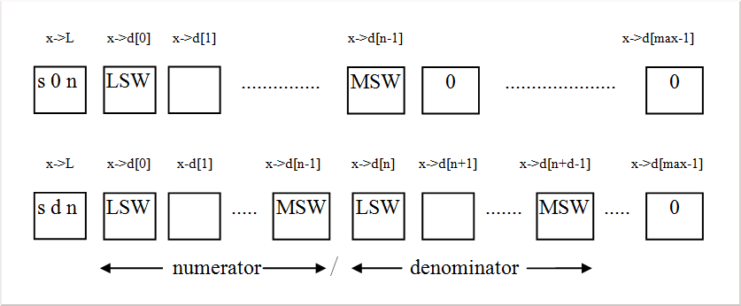

* [Intro](README.md)
* [Installation](installation.md)
* [The UI](the-ui.md)
* Internal Rep
* [Implementation](implementation.md)
* [Floating Slash Nums](floating-slash-nums.md)
* [The C++ Interface](the-cpp-interface.md)
* [Example Programs](example-progs.md)
* [The MIRACL Routines](miracl-explained/reference-manual/low-level-routines.md)
* [Instance Variables](instance-variables.md)
* [MIRACL Error Messages](miracl-error-messages.md)
* [Hardware Compiler Interface](hardware-compiler-interface.md)
* [Bibliography](bibliography.md)


Internal Representation
---

Conventional computer arithmetic facilities as provided by most computer language compilers usually provide one or two floating-point data types (e.g. single and double precision) to represent all the real numbers, together with one or more integer types to represent whole numbers. These built-in data-types are closely related to the underlying computer architecture, which is sensibly designed to work quickly with large amounts of small numbers, rather than slowly with small amounts of large numbers (given a fixed memory allocation). Floating-point allows a relatively small binary number (e.g. 32 bits) to represent real numbers to an adequate precision (e.g. 7 decimal places) over a large dynamic range. Integer types allow small whole numbers to be represented directly by their binary equivalent, or in 2's complement form if negative. Nevertheless this conventional approach to computer arithmetic has several disadvantages.

- Floating-point and Integer data-types are incompatible. Note that the set of integers, although infinite, is a subset of the rationals (i.e. fractions), which is in turn a subset of the reals. Thus every integer has an equivalent floating-point representation. Unfortunately these two representations will in general be different. For example a small positive whole number will be represented by its binary equivalent as an integer, and as separated mantissa and exponent as a floating-point. This implies the need for conversion routines, to convert from one form to the other.

- Most rational numbers cannot be expressed exactly (e.g. 1/3). Indeed the floating-point system can only express exactly those rationals whose denominators are multiples of the factors of the underlying radix. For example our familiar decimal system can only represent exactly those rational numbers whose denominators are multiples of 2 and 5; 1/20 is 0.05 exactly, 1/21 is 0.0476190476190.....

- Rounding in floating-point is base-dependent and a source of obscure errors.

- The fact that the size of integer and floating-point data types are dictated by the computer architecture, defeats the efforts of language designers to keep their languages truly portable.

- Numbers can only be represented to a fixed machine-dependent precision. In many applications this can be a crippling disadvantage, for example in the new and growing field of Public-Key cryptography.

- Base-dependent phenomena cannot easily be studied. For example it would be difficult to access a particular digit of a decimal number, as represented by a traditional integer data-type.

Herein is described a set of standard C routines which manipulate multi-precision rational numbers directly, with multi-precision integers as a compatible subset. Approximate real arithmetic can also be performed.

The two new data-types are called *big* and *flash*. The former is used to store multi-precision integers, and the latter stores multi-precision fractions as numerator and denominator in ‘floating-slash’ form. Both take the form of a fixed length array of digits, with sign and length information encoded in a separate 32-bit integer. The data type defined as **mr_small** used to store the number digits will be one of the built in types, for example int, long or even double. This is referred to as the “underlying type”.

Both new types can be introduced into the syntax of the C language by the C statements:
```
struct bigtype
{
     mr_unsign32 L;
     mr_small *d;

};

typedef struct bigtype *big;
typedef struct bigtype *flash;
```

Now *big* and *flash* variables can be declared just like any built-in data type, for example:
```
big x,y[10],z[10][10];
```
Observe that a *big* is just a pointer. The memory needed for each *big* or *flash* number instance is taken from the heap (or from the stack). Therefore each *big* or *flash* number must be initialised before use, and the required memory assigned to it.

Note that the user of these data-types is not concerned with this internal representation; the library routines allow *big* and *flash* numbers to be manipulated directly.

The structure of *big* and *flash* numbers is illustrated in figure (4.1).

These structures combine ease of use with representational efficiency. A denominator of length zero (d=0), implies an actual denominator of one; and similarly a numerator of length zero (n=0) implies a numerator of one. Zero itself is uniquely defined as the number whose first element is zero (i.e. n=d=0).

Figure 4.1:   Structure of *big* and *flash* data-types where *s* is the sign of the number, *n* and *d* are the lengths of the numerator and denominator respectively, and LSW and MSW mean ‘Least significant word and ‘Most significant word’ respectively.

Note that the slash in the *flash* data-type is not in a fixed position, and may ‘float’ depending on the relative size of numerator and denominator.

A *flash* number is manipulated by splitting it up into separate big numerator and denominator components. A big number is manipulated by extracting and operating on each of its component integer elements. To avoid possible overflow, the numbers in each element are normally limited to a somewhat smaller range than that of the full word-length, e.g. 0 to 32767 (= 215 - 1) on a 16-bit computer. However with careful programming a full-width base of 216 can also be used, as the C language does not report a run-time error on integer overflow [Scott89b].

When the system is initialised the user specifies the fixed number of words (or bytes) to be assigned to all *big* or *flash* variables, and the number base to be used. Any base can be used, up to a maximum which is dependent on the word length of the computer used. If requested to use a small base *b*, the system will, for optimal efficiency, actually use base *bn*, where *n* is the largest integer such that *bn* fits in a single computer word. Programs will in general execute fastest if a full-width base is used (achieved by specifying a base of 0 in the initial call to **mirsys**). Note that this mode may be supported by extensive in-line assembly language for certain popular compiler/processor combinations, in certain time-critical routines, for example if using Borland/Turbo C with an 80x86 processor. Examine, for example, the source code in module *mrarth1.c*.

The encoding of the sign and numerator and denominator size information into a single word is possible, as the C language has standard constructs for bit manipulation.
