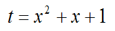
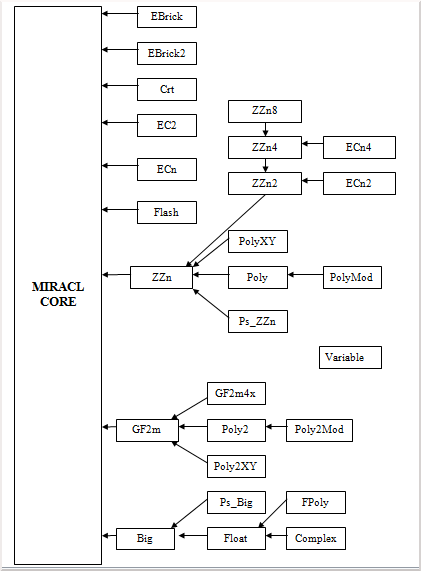

* [Intro](README.md)
* [Installation](installation.md)
* [The UI](the-ui.md)
* [Internal Rep](internal-rep.md)
* [Implementation](implementation.md)
* [Floating Slash Nums](floating-slash-nums.md)
* The C++ Interface
* [Example Programs](example-progs.md)
* [The MIRACL Routines](miracl-explained/reference-manual/low-level-routines.md)
* [Instance Variables](instance-variables.md)
* [MIRACL Error Messages](miracl-error-messages.md)
* [Hardware Compiler Interface](hardware-compiler-interface.md)
* [Bibliography](bibliography.md)

The C++ Interface
---

Many users of the MIRACL package would be disappointed that they have to calculate:

for a flash variable x by the sequence

       fmul(x,x,t);
       fadd(t,x,t);
       fincr(t,1,1,t);

rather than by simply

       t=x*x+x+1;

Someone could of course use the MIRACL library to write a special purpose C compiler which could properly interpret such an instruction (see Cherry and Morris [Cherry] for an example of this approach). However such a drastic step is not necessary. A superset of C, called C++ has gained general acceptance as the natural successor to C. The enhancements to C are mainly aimed at making it an object-oriented language. By defining *big* and *flash* variables as ‘classes’ (in C++ terminology), it is possible to ‘overload’ the usual mathematical operators, so that the compiler will automatically substitute calls to the appropriate MIRACL routines when these operators are used in conjunction with *big* or *flash* variables. Furthermore C++ is able to look after the initialisation (and ultimate elimination) of these data-types automatically, using its constructor/destructor mechanism, which is included with the class definition. This relieves the programmer from the tedium of explicitly initialising each *big* and *flash* variable by repeated calls to **mirvar** . Indeed once the classes are properly defined and set up, it is as simple to work with the new data-types as with the built-in *double* and *int* types. Using C++ also helps shield the user from the internal workings of MIRACL.

The MIRACL library is interfaced to C++ via the header files *big.h*, *flash.h*, *zzn.h*, *gf2m.h*, *ecn.h* and *ec2.h* . Function implementation is in the associated files *big.cpp*, *flash.cpp*, *zzn.cpp*, *gf2m.cpp*, *ecn.cpp* and *ec2.cpp*, which must be linked into any application that requires them. The Chinese Remainder Theorem is also elegantly implemented as a class, in files *crt.h* and *crt.cpp* . See *decode.cpp* for an example of use. The Comb method for fast modular exponentiation with precomputation [HAC] is implemented in *brick.h* . See *brick.cpp* for an example of use. The GF(*p*) elliptic curve equivalents are in *ebrick.h* and *ebrick.cpp* and the GF(2<sup>m</sup>) elliptic curve equivalents in *ebrick2.h* and *ebrick2.cpp* respectively.

## Example
```
/*
 *  Program to calculate factorials.
 */

#include <iostream>
#include "big.h"  /* include MIRACL system */

using namespace std;

Miracl precision(500,10); // This makes sure that MIRACL
             // is initialised before main() // is called

void main()
{ /* calculate factorial of number */
  Big nf=1;    /* declare "Big" variable nf */
  int n;
  cout << "factorial program\n";
  cout << "input number n= \n";
  cin >> n;

  while (n>1)
    nf*=(n--); /* nf=n!=n*(n-1)*(n-2)*....3*2*1 */

  cout << "n!= \n" << nf << "\n";
}
```
Compare this with the C version in 'The User Interface'. Note the neat use of a dummy class *Miracl* used to set the precision of the *big* variables. Its declaration at global scope ensures that MIRACL is initialised before *main()* is called. (Note that this would not be appropriate in a multi-threaded environment.) When compiling and linking this program, don’t forget to link in the *Big* class implementation file *big.cpp* .

Conversion to/from internal *Big* format is quite important:-

To convert a hex character string to a *Big*
```
Big x;
char c[100];
...
mip->IOBASE=16;
x=c;
```
To convert a Big to a hex character string
```
mip->IOBASE=16;
c << x;
```
To convert to/from pure binary, use the **from_binary( )** and **to_binary( )** friend functions.
```
int len;
char c[100];
...
Big x=from_binary(len,c);
// creates Big x from len bytes of binary in c
len=to_binary(x,100,c,FALSE);
// converts Big x to len bytes binary in c[100]
len=to_binary(x,100,c,TRUE);
// converts Big x to len bytes binary in c[100]
// (right justified with leading zeros)
```
In many of the example programs, particularly the factoring programs, all the arithmetic is done *mod n*. To avoid the tedious reduction *mod n* required after each operation, a new C++ class ZZ*n* has been used, and defined in the file *zzn.h*. This class *ZZn* (for *ZZ(n)* or the ring of integers *mod n*) has its arithmetic operators defined to automatically perform the reduction. The function **modulo(n)** sets the modulus. In an analogous fashion the C++ class GF2*m* deals with elements of the field defined over GF(2<sup>m</sup>). In this case the “modulus” is set via **modulo(m,a,b,c)**, which also specifies either a trinomial basis t<sup>m</sup> + t<sup>a</sup> +1, (and set b=c=0), or a pentanomial basis t<sup>m</sup> + t<sup>a</sup> + t<sup>b</sup> + t<sup>c</sup> +1. See the [IEEE P1363](http://grouper.ieee.org/groups/1363/) documentation for details.

Internally the ZZ*n* class uses Montgomery representation. See *zzn.h* . Note that the internal implementation of ZZ*n* is hidden from the application programmer, a classic feature of C++. Thus the awkward internals of Montgomery representation need not concern the C++ programmer.

The class EC*n* defined in *ecn.h* makes manipulation of points on GF (*p*) elliptic curves a simple matter, again hiding all the grizzly details. The class EC2 defined in *ec2.h* does the same for GF(2<sup>m</sup>) elliptic curves.

Almost all of MIRACL’s functionality is accessible from C++. Programming can often be done intuitively, without reference to this manual, using familiar C syntax as illustrated above. Other functions are accessed using the ‘obvious’ syntax - as in for example x=gcd(x,y);, or y=sin(x);. For more details examine the header files and example programs.

C++ versions of most of the example programs are included in the distribution media, with the file extensions *.cpp* .

One problem with manipulating large objects in C++ is the tendency of the compiler to generate code to create/destroy/copy multiple temporary objects. By default MIRACL obtains memory for *Big* and *Flash* variables from the heap. This can be quite time-consuming, and all such objects need ultimately to be destroyed. It would be faster to assign memory instead from the stack, especially for relative small big numbers. This can now be achieved by defining **BIGS=m** at compilation time. For example if using the Microsoft C++ compiler from the command line:

    C:miracl>cl /O2 /GX /DBIGS=50 brent.cpp big.cpp zzn.cpp miracl.lib

Note that the value of **m** should be the same as or less than the value of **n** that is specified in the call to mirsys(**n**,0); or in Miracl precision=**n**; in the main program.

When using finite-field arithmetic, valid numbers are always less than a certain fixed modulus. For example in the finite field mod *n*, the class defined in *zzn.h* and *zzn.cpp* might handle numbers with respect to a 512-bit modulus *n*, which is set by **modulo(n)**. In this case one can define **ZZNS=16** so that all elements are of a size 16x32=512, and are created on the stack. (This works particularly well in combination with the Comba mechanism described in 'Implementation'.)

In a similar fashion, when working over the field GF(2<sup>283</sup>), one can define **GF2MS=9**, so that all elements in the field are stored in a fixed memory allocation of 9 words taken from the stack.

In these latter two cases the precision **n** specified in the call to mirsys(**n**,0); or in Miracl precision=n; in the main program should be at least 2 greater than the **m** that specified in the **ZZNS=m** or **GF2MS=m** definition.

This is not recommended for program development, or if the objects are very large. It is only relevant with C++ programs. See the comments in the sample programs *ibe_dec.cpp* and *dl.cpp* for examples of the use of this mechanism. However the benefits can often be substantial – programs may be up to twice as fast.

Finally here is a more elaborate C++ program to implement a relatively complex cryptographic protocol. Note the convention of using capitalised variables for field elements.
```
/*
 *  Gunthers's ID based key exchange - Finite field version
 *  See RFC 1824
 *  r^r variant (with Perfect Forward Security)
 */

#include <iostream>
#include <fstream>
#include "zzn.h"

using namespace std;

Miracl precision=100;

char *IDa="Identity 1";
char *IDb="Identity 2";

// Hash function
Big H(char *ID)
{ // hash character string to 160-bit big number
  int b;
  Big h;
  char s[20];
  sha sh;
  shs_init(&sh);
  while (*ID!=0) shs_process(&sh,*ID++);
  shs_hash(&sh,s);
  h=from_binary(20,s);
  return h;
}

int main()
{
  int bits;
  ifstream common("common.dss");  // construct file stream
  Big p,q,g,x,k,ra,rb,sa,sb,ta,tb,wa,wb;
  ZZn G,Y,Ra,Rb,Ua,Ub,Va,Vb,Key;
  ZZn A[4];
  Big b[4];
  long seed;
  miracl *mip=&precision;
  cout << "Enter 9 digit random number seed = ";
  cin >> seed; irand(seed);

// get common data. Its in hex. G^q mod p = 1
  common >> bits;
  mip->IOBASE=16;
  common >> p >> q >> g;
  mip->IOBASE=10;
  modulo(p);  // set modulus

  G=(ZZn)g;

  cout << "Setting up Certification Authority ... " << endl;

// CA generates its secret and public keys

  x=rand(q);    // CA secret key, 0 < x < q
  Y=pow(G,x);    // CA public key, Y=G^x

  cout << "Visiting CA ...." << endl;

// Visit to CA - a
  k=rand(q);
  Ra=pow(G,k);
  ra=(Big)Ra%q;
  sa=(H(IDa)+(k*ra)%q);
  sa=(sa*inverse(x,q))%q;

// Visit to CA - b
  k=rand(q);
  Rb=pow(G,k);
  rb=(Big)Rb%q;
  sb=(H(IDb)+(k*rb)%q);
  sb=(sb*inverse(x,q))%q;

  cout << "Offline calculations .... " << endl;

// offline calculation - a
  wa=rand(q);
  Va=pow(G,wa);
  ta=rand(q);
  Ua=pow(Y,ta);

// offline calculation - b
  wb=rand(q);
  Vb=pow(G,wb);
  tb=rand(q);
  Ub=pow(Y,tb);

// Swap ID, R, U, V
  cout << "Calculate Key ... " << endl;

// calculate key – a
// Key = Vb^wa.Ub^sa.G^[(H(IDa)*tb)%q].Rb^[(rb*ta)%q]  mod p

  rb=(Big)Rb%q;
  A[0]=Vb; A[1]=Ub; A[2]=G; A[3]=Rb;
  b[0]=wa; b[1]=sa; b[2]=(H(IDb)*ta)%q; b[3]=(rb*ta)%q;

  Key=pow(4,A,b);  // extended exponentiation
  cout << "Key= \n" << Key << endl;

// calculate key - b
  ra=(Big)Ra%q;
  A[0]=Va; A[1]=Ua; A[2]=G; A[3]=Ra;
  b[0]=wb; b[1]=sb; b[2]=(H(IDa)*tb)%q; b[3]=(ra*tb)%q;

  Key=pow(4,A,b);  // extended exponentiation
  cout << "Key= \n" << Key << endl;
  return 0;
}
```

MIRACL has evolved quite a complex class hierarchy – see the diagram below. Where possible classes are built directly on top of the C/assembly core. Note the support for polynomials, power series and extension fields.

